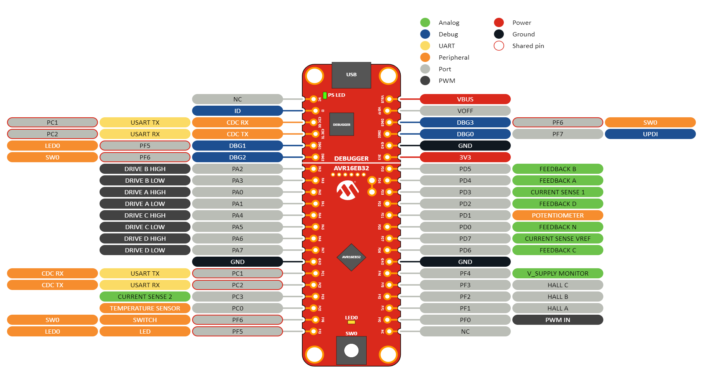
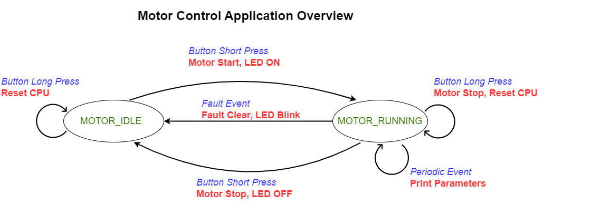
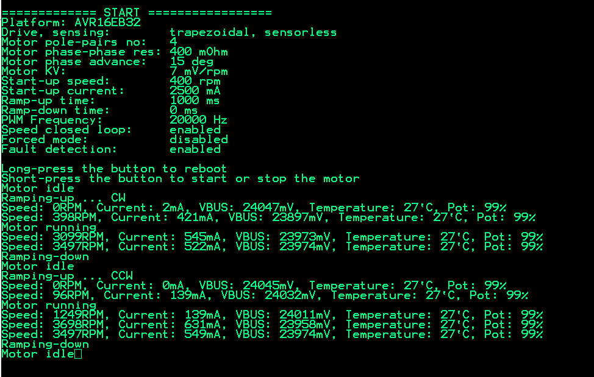
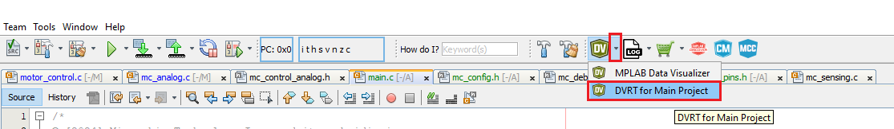
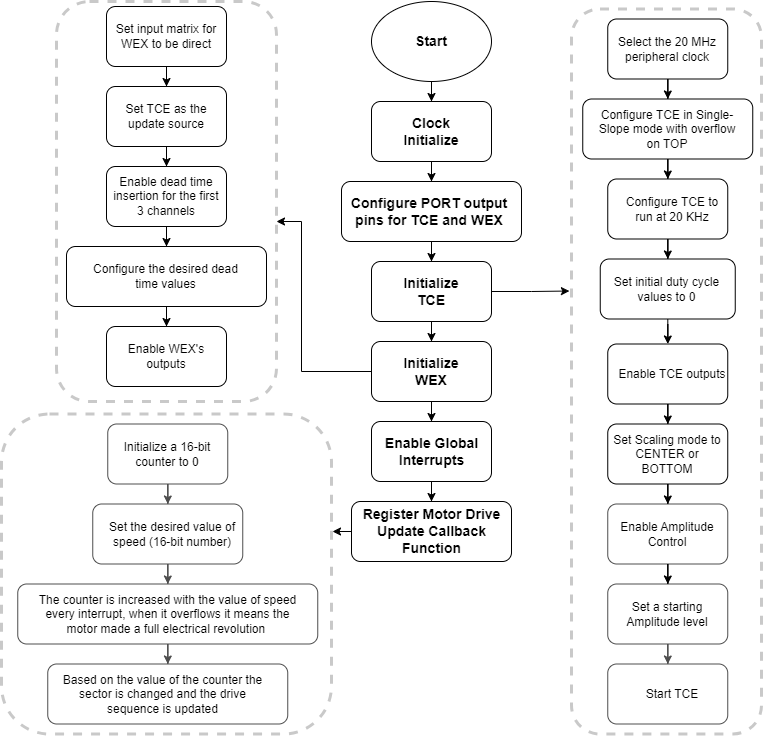

[](https://www.microchip.com)

<h2> Table of Contents </h2>

- [Motor Control With AVR®](#motor-control-with-avr)
- [Release Notes](#release-notes)
- [Related Documentation](#related-documentation)
- [Software Used](#software-used)
- [Hardware Used](#hardware-used)
- [Quick Start Guide](#quick-start-guide)
  - [Hardware Setup](#hardware-setup)
  - [Software Setup](#software-setup)
  - [Predefined Config Settings](#predefined-config-settings)
- [Application Usage](#application-usage)
  - [Let's spin the motor](#lets-spin-the-motor)
  - [Basic Functionality](#basic-functionality)
  - [Console Interface](#console-interface)
  - [DVRT Tool Interface](#dvrt-tool-interface)
- [Motor Control Software Description](#motor-control-software-description)
  - [Application Programming Interface Functions](#application-programming-interface-functions)
  - [Configurable Parameters](#configurable-parameters)
  - [Fault Limits Settings](#fault-limits-settings)
  - [Control Layer](#control-layer)
    - [Open Loop Synchronization](#open-loop-synchronization)
    - [Closed Loop Control](#closed-loop-control)
  - [Drive Layer](#drive-layer)
    - [Trapezoidal Drive](#trapezoidal-drive)
    - [Sinusoidal Drive](#sinusoidal-drive)
  - [Feedback Sensing Layer](#feedback-sensing-layer)
    - [Sensored Mode](#sensored-mode)
    - [Sensorless Mode](#sensorless-mode)
  - [Analog Interface Layer](#analog-interface-layer)
  - [Fault Layer](#fault-layer)
    - [Slow Acting Protection](#slow-acting-protection)
    - [Fast Acting Protection](#fast-acting-protection)
- [Results](#results)
  - [Trapezoidal Drive](#trapezoidal-drive-1)
  - [Sinusoidal Drive](#sinusoidal-drive-1)
- [Troubleshooting Guide](#troubleshooting-guide)
  - [Scenario 1: Can't program the board](#scenario-1-cant-program-the-board)
  - [Scenario 2: The motor does nothing when the MPPB button is pressed](#scenario-2-the-motor-does-nothing-when-the-mppb-button-is-pressed)
  - [Scenario 3: The motor starts spinning with vibrations and stops, then the red LED blinks five times](#scenario-3-the-motor-starts-spinning-with-vibrations-and-stops-then-the-red-led-blinks-five-times)
  - [Scenario 4: The motor starts, spins a few times, then stops or runs erratically](#scenario-4-the-motor-starts-spins-a-few-times-then-stops-or-runs-erratically)
  - [Scenario 5: The motor is spinning, but it consumes a lot of current](#scenario-5-the-motor-is-spinning-but-it-consumes-a-lot-of-current)
  - [Scenario 6: Motor starts, then unexpectedly starts shaking, vibrating, then stops](#scenario-6-motor-starts-then-unexpectedly-starts-shaking-vibrating-then-stops)
  - [Scenario 7: Motor starts normally, but when turning the potentiometer it enters Stall mode, then stops](#scenario-7-motor-starts-normally-but-when-turning-the-potentiometer-it-enters-stall-mode-then-stops)
  - [Scenario 8: Console Interface doesn't display any data](#scenario-8-console-interface-doesnt-display-any-data)
  - [Scenario 9: DVRT tool doesn't display any data](#scenario-9-dvrt-tool-doesnt-display-any-data)
  - [Scenario 10: Changes made in `mc_config.h` have no effect](#scenario-10-changes-made-in-mc_configh-have-no-effect)
  - [Scenario 11: CNANO board is not recognised in MPLAB X IDE](#scenario-11-cnano-board-is-not-recognised-in-mplab-x-ide)
  - [Scenario 12: Hall scan process fails](#scenario-12-hall-scan-process-fails)
- [Summary](#summary)

## Motor Control With AVR®

- This repository contains one bare metal source code example for a Motor Control application supporting Sinusoidal Sensored, Trapezoidal Sensored and Trapezoidal Sensorless control, using the new AVR EB family of devices. Check the [*Release Notes*](#release-notes) section to see all the available functionality on the current release. The approach for this application is focused on the dedicated hardware peripherals of the AVR16EB32 microcontroller (MCU), which reduce the amount of memory used and the Central Process Unit (CPU) overhead as some mathematical calculations are done in hardware by this device.

- AVR EB has two new peripherals, the Timer Counter type E (TCE) and a Waveform Extension (WEX), that have new hardware capabilities meant to takeover software functions usually used in motor control, as described in [Getting started with TCE and WEX](https://onlinedocs.microchip.com/oxy/GUID-8FB8D192-E8C9-4748-B991-D4D842E01591-en-US-1/index.html) and in the [AVR EB data sheet](https://www.microchip.com/en-us/product/avr16eb32#document-table).
  
- The functionality of the application is to obtain a Trapezoidal (6-step block commutation) and a Sinusoidal drive method with motor synchronization, with support for both sensored and sensorless feedback types. The focus is on Brushless Direct Current (BLDC) motors and Permanent Magnet Synchronous Motors (PMSMs).

- The Sensored feedback and synchronization is achieved using Hall sensors. A software algorithm is used to overcome possible faulty transitions of Hall sensors, due to noise or mechanical misalignments, and thus correctly detecting the rotor's position and synchronize the motor with the driving signals.

- The Sensorless feedback and synchronization is achieved using the Zero-Cross Detection (ZCD) of Back-Electromotive Force (BEMF) of the three phases of the motor. Each phase of the motor is filtered to determine when to commutate the motor drive voltages. The position of the rotor sensing algorithm is the same as in the Sensored case, the only difference is the commutation timing, which differs from Hall sensors to BEMF.

## Release Notes

Current version 1.2.0 features:

- Motor specification in configuration file
- Trapezoidal drive
- Sensored Sinusoidal drive (Space Vector Pulse-Width Modulation (SVPWM) profile, Saddle profile, Pure sinusoidal)
- Hall Sensor feedback support
- BEMF sensing
- Motor–Drive (Rotor-Stator) synchronization (Open loop)
- Phase Advance selection
- Start and stop ramps
- MPLAB® Data Visualizer Run Time (DVRT) communication support for plotting parameters in real time
- Proportional-Integral (PI) algorithm with fixed parameters for Closed Loop control over speed regulation
- Fault support for Hardware Peak Overcurrent Protection (Peak OCP) and Software Average Overcurrent Protection (Avg OCP), Overvoltage Protection (OVP), Undervoltage Protection (UVP), Overtemperature Protection (OTEMP), Stall Detection and Hall sensor disconnection
- Current, Voltage Bus, Temperature and Potentiometer analog measurements at run-time
- Variable switching frequency from 15 kHz to 45 kHz
- Low speed Sensored control (5% of the motor's nominal speed)
- Hall sensors autodetection algorithm at startup

Known issues and future improvements:

- Sinusoidal drive harmonic current distortion in light load condition
- Sinusoidal sensorless drive
- Configurable (PI) algorithm for Closed Loop control over speed regulation
- Profiler tool for motor self-commissioning
- PWM input for compatibility with radio-controlled receivers

## Related Documentation

More details and code examples on the AVR16EB32 can be found at the following links:

- [AVR<sup>®</sup> EB Product Page](https://www.microchip.com/en-us/products/microcontrollers-and-microprocessors/8-bit-mcus/avr-mcus/avr-eb?utm_source=GitHub&utm_medium=TextLink&utm_campaign=MCU8_AVR-EB&utm_content=avr16eb32-bldc-pmsm-motor-control-library-github&utm_bu=MCU08)
- [AVR<sup>®</sup> EB Code Examples on GitHub](https://github.com/microchip-pic-avr-examples?q=AVR16EB32)

## Software Used

- [MPLAB® X IDE v6.20 or newer](https://www.microchip.com/en-us/tools-resources/develop/mplab-x-ide?utm_source=GitHub&utm_medium=TextLink&utm_campaign=MCU8_AVR-EB&utm_content=avr16eb32-bldc-pmsm-motor-control-library-github&utm_bu=MCU08)
- [AVR-Ex DFP-2.10.205 or newer Device Pack](https://packs.download.microchip.com/)
- [MPLAB® XC8 compiler v2.50](https://www.microchip.com/en-us/tools-resources/develop/mplab-xc-compilers?utm_source=GitHub&utm_medium=TextLink&utm_campaign=MCU8_AVR-EB&utm_content=avr16eb32-bldc-pmsm-motor-control-library-github&utm_bu=MCU08)

## Hardware Used

- [AVR<sup>®</sup> EB Curiosity Nano](https://www.microchip.com/en-us/development-tool/EV73J36A)
- [Multi-Phase Power Board (MPPB)](https://www.microchip.com/en-us/development-tool/EV35Z86A)
- [AVR EB Curiosity Nano Adaptor to MPPB](https://www.microchip.com/en-us/development-tool/EV88N31A)
- BLDC Motor (Suggestion: ACT57BLF02)
- A Voltage power supply (6-50V and 5A limit, depending on the motor used)

## Quick Start Guide

### Hardware Setup

The AVR16EB32 Curiosity Nano Development board is used along with the MPPB, AVR EB CNANO to MPPB Adaptor board, the BLDC Motor and a Voltage power supply.

<br>Connections steps:

1. Plug in the AVR16EB32 CNANO board in the connector present on the MPPB Adaptor board.
2. Plug in the MPPB Adaptor board to the MPPB board.
3. Connect the Voltage power supply wires to the V_SUPPLY conector from the MPPB.
4. Connect motor phase wires to the PHASE connector from MPPB in any order. The connection will establish the motor spinning direction. The application might report a reverted direction (clockwise or conterclockwise) compared to the real one.
5. If sensored control is preferred, connect motor Hall sensor wires to the HALL SENSOR connector from the MPPB in any order. It doesn't matter how the wires are connected, the algorithm will auto detect the right succession of hall sensors.

<br>

The A, B, C wire connection succession is not mandatory for both phases and Hall sensors.<br>
If the MPPB and the Adaptor boards are not used, the user can integrate the AVR EB into another hardware setup by using the following pinout:

<h4> AVR16EB32 CNANO Board Motor Control Pinout </h4>

<br>

<br> All the pins can be configured in the `mc_pins.h` file.

### Software Setup

1. Connect the AVR EB CNANO board to the PC.

2. Open the ```mc_demo.X``` project in MPLAB X IDE.

3. Right click the project and select Set as Main Project.

<br>

4. Edit the [`mc_config.h`](#configurable-parameters) file, found in `mc_demo/Application/Configuration headers`, with the utilized motor parameters and drive options. See [Predefined Config Settings](#predefined-config-settings) for examples.

5. Edit the [`mc_limits.h`](#fault-limits) file, found in `mc_demo/Application/Configuration headers`, with the hardware and motor used specifications. See [Fault Limits](#fault-limits) for explanations.

6. Build the ```mc_demo.X``` project by clicking **Clean and Build Project**.

<br>

7. Click **Make and Program Device** to program the project to the board.

<br>

### Predefined Config Settings

This is a set of configuration settings, apart from the default values, needed to run the demo in Trapezoidal Sensorless/Sensored or Sinusoidal Sensored mode, with the motor ACT57BLF02.<br> In configuration file [`mc_config.h`](#configurable-parameters) edit the settings according to the usage scenario. 

<br><h3> 1. Trapezoidal Sensorless </h3>
```c
/* possible values:  MC_SENSORED_MODE, MC_SENSORLESS_MODE  */
#define MC_CONTROL_MODE                 MC_SENSORLESS_MODE

/* possible values:  MC_CONTINUOUS_MODE, MC_STEPPED_MODE  */
#define MC_DRIVE_MODE                   MC_STEPPED_MODE

/* motor specific settings */
#define MOTOR_PHASE_ADVANCE             (15.0)   /* degrees */
#define MC_MOTOR_PAIR_POLES             (4)      /* pole pairs */
#define MC_MOTOR_PHASE_PHASE_RESISTANCE (0.4)    /* ohm */
#define MC_MOTOR_KV                     (0.007)  /* volt/rpm */
#define MC_RAMP_UP_DURATION             (1000)   /* milliseconds */
#define MC_RAMP_DOWN_DURATION           (0)      /* milliseconds */
#define MC_STARTUP_CURRENT              (2.5)    /* initial current amplitude [amperes] */
#define MC_STARTUP_SPEED                (400)    /* switchover speed [rpm] */
```
For Sensorless mode, the `MC_STARTUP_SPEED` must be set to at least 10-15% of the nominal speed of the motor.<br>
`MC_STARTUP_CURRENT` parameter must be set to 20-30% of the motor's rated current value. For more details see [Sensorless Mode](#sensorless-mode).

<br><h3> 2. Trapezoidal Sensored </h3>
```c
/* possible values:  MC_SENSORED_MODE, MC_SENSORLESS_MODE  */
#define MC_CONTROL_MODE                 MC_SENSORED_MODE

/* possible values:  MC_CONTINUOUS_MODE, MC_STEPPED_MODE  */
#define MC_DRIVE_MODE                   MC_STEPPED_MODE


/* motor specific settings */
#define MOTOR_PHASE_ADVANCE             (15.0)   /* degrees */
#define MC_MOTOR_PAIR_POLES             (4)      /* pole pairs */
#define MC_MOTOR_PHASE_PHASE_RESISTANCE (0.4)    /* ohm */
#define MC_MOTOR_KV                     (0.007)  /* volt/rpm */
#define MC_RAMP_UP_DURATION             (1000)   /* milliseconds */
#define MC_RAMP_DOWN_DURATION           (0)      /* milliseconds */
#define MC_STARTUP_CURRENT              (2.5)    /* initial current amplitude [amperes] */
#define MC_STARTUP_SPEED                (60)     /* switchover speed [rpm] */
```
For Trapezoidal Sensored mode, the `MC_STARTUP_SPEED` must be set to at least 2-5% of the nominal speed of the motor.<br>
`MC_STARTUP_CURRENT` parameter must be set to 20-30% of the motor's rated current value. For more details see [Sensored Mode](#sensored-mode).

<br><h3> 3. Sinusoidal Sensored </h3>
```c
/* possible values:  MC_SENSORED_MODE, MC_SENSORLESS_MODE  */
#define MC_CONTROL_MODE                 MC_SENSORED_MODE

/* possible values:  MC_CONTINUOUS_MODE, MC_STEPPED_MODE  */
#define MC_DRIVE_MODE                   MC_CONTINUOUS_MODE

/* possible values:  MC_WAVE_SINE, MC_WAVE_SVM, MC_WAVE_SADDLE */
#define MC_WAVE_PROFILE                 MC_WAVE_SADDLE

/* motor specific settings */
#define MOTOR_PHASE_ADVANCE             (15.0)   /* degrees */
#define MC_MOTOR_PAIR_POLES             (4)      /* pole pairs */
#define MC_MOTOR_PHASE_PHASE_RESISTANCE (0.4)    /* ohm */
#define MC_MOTOR_KV                     (0.007)  /* volt/rpm */
#define MC_RAMP_UP_DURATION             (1000)   /* milliseconds */
#define MC_RAMP_DOWN_DURATION           (0)      /* milliseconds */
#define MC_STARTUP_CURRENT              (1.0)    /* initial current amplitude [amperes] */
#define MC_STARTUP_SPEED                (60)     /* switchover speed [rpm] */
```
For Sinsoidal Sensored mode, the `MC_STARTUP_SPEED` must be set to at least 2-5% of the nominal speed of the motor.<br>
`MC_STARTUP_CURRENT` parameter must be set to 10-15% of the motor's rated current value. For more details see [Sensored Mode](#sensored-mode).

## Application Usage

### Let's spin the motor

After all the steps from [Quick Start Guide](#quick-start-guide) are completed, turn the MPPB potentiometer to 50% then press the MPPB button to spin the motor in clockwise direction.
Depending on the phase wires connection to the MPPB, the actual spinning directiom might differ from the one reported by the application.

### Basic Functionality

<br>1. Short press the button present on the MPPB board. The motor starts spinning in clockwise (CW) direction and enters the Running state. The LED from MPPB turns on. Speed can be adjusted by using the potentiometer present on the MPPB board.
<br>2. Short press the button from MPPB again. The motor spins down, stops and enters an Idle state. The LED from MPPB turns off.
<br>3. Short press the button a third time. The motor starts spinning in counterclockwise (CCW) direction and enters the Running state. The LED from MPPB turns on. The Speed can be adjusted by using the potentiometer present on the MPPB board.
<br>4. Short press the button a fourth time. The motor is spinning down, stops and enters Idle state. The LED from MPPB turns off.
<br>5. Short press the button a fifth time. Go back to step 1. </br>
<br> Long press the button (more than 1.5 seconds) to restart the application.
<br> If a Fault event occurs, the motor stops and enters the Idle state. The LED from MPPB blinks until the fault condition is cleared.

<br> After the [Quick Start Guide](#quick-start-guide) setup steps are done, the user can start spinning the motor using the button on the MPPB. By short-pressing the button (under 1.5 seconds) the motor will start spinning in the CW direction in Forced Commutation using a ramp-up to reach a threshold value of speed in a configurable amount of time. After the ramp-up is finished, the application switches to Synchronization mode, either with feedback coming from Hall sensors or BEMF ZCD, depending what is chosen in the `mc_config.h` file.
<br> The speed of the motor is imposed from the potentiometer present on the MPPB. When the motor starts spinning and the synchronization and speed regulation algorithms start working, the LED from MPPB is turned ON. The motor can be stopped by short-pressing the button again. When the stop command is given, the application sets the three motor phases in Floating state; amplitude and speed are set to zero, and from then on the motor will stop naturally, depending on the rotor inertia and the load.
<br> If the button is short-pressed a third time, the motor will start spinning again, but this time in the CCW direction, with the same functionality described above. The user can change the direction of rotation at run-time for as many times as needed, by two short presses of the button from the MPPB. The application can be restarted by long-pressing the button from MPPB for more than 1.5 seconds.
<br> In case of a Fault event, the motor stops spinning and enters in an Idle state. The normal operation can only be restored if the fault condition is gone and the user short presses the button.
<br> The main application functionality and overview flowcharts are shown below:

<br>

<br>

The application has two types of communication interfaces, only one enabled at a single moment of time:

 1. Console interface.
 2. DVRT tool interface.

### Console Interface

To activate it, the `MC_PRINTOUT_ENABLED` must be set to true in [`mc_config.h`](#configurable-parameters) file. Then simply open a PC software terminal, select the UART protocol, 8N1, with a baud-rate of 460800 bps.
<br> The serial interface provides information about the Drive mode, PWM Scale mode, Sense mode, pole-pairs number, state of the motor, direction of rotation, speed in RPM, voltage, temperature, average current consumption and potentiometer percentage. The periodic interval for printing variables is given in milliseconds and can be configured from `MC_PRINTOUT_REFRESH_INTERVAL` parameter.
<br> All the LED and button functionality are the same as in the [basic functionality](#basic-functionality) section.

<br>

### DVRT Tool Interface

To activate it, the `MC_DVRT_ENABLED` must be set to true in [`mc_config.h`](#configurable-parameters) file. This tool provides capabilities to plot graph with variables in real time at run-time. Follow the steps below to get the DVRT running:

<br>1. Build, compile and program AVR EB with DVRT support enabled.

<br>2. MPLAB Data Visualizer has a stand-alone version or an MPLAB X IDE integrated version. The stand-alone tool can be downloaded and installed from this [link](https://www.microchip.com/en-us/tools-resources/debug/mplab-data-visualizer?utm_source=GitHub&utm_medium=TextLink&utm_campaign=MCU8_AVR-EB&utm_content=avr16eb32-bldc-pmsm-motor-control-library-github&utm_bu=MCU08).

<br> To use the stand-alone version, open MPLAB Data Visualizer and start a new DVRT Session.

<br>

<br> To use the MPLAB X integrated version, click the drop-down arrow of the green icon and select DVRT for Main Project, as shown in the image below:

<br>

<br>3.The user can press the **Load** button and then go to `avr16eb32-bldc-pmsm-motor-control-demo\Apps\mc_demo.X` and load the `mc_demo_eb_dvws` file. This file has predefined baud, communication port settings and two variables added (potentiometer and speed).

<br>

<br>4. *Optional: Change streaming tick to 1 ms and toggle the dark theme.

<br>

<br>5. Click the play button, and plot all variables button.

<br>

Capture with dark theme enabled of potentiometer in percentage (green) and speed in RPM (yellow) at run-time:

<br>

If loading the `mc_demo_eb_dvws` file fails, the user can manually configure the DVRT tool following the next steps:

<br>1. Start DVRT standalone version or MPLAB integrated plugin.

<br>2. Select the AVR EB communication PORT

<br>

<br>3. Set the baud rate to 460800 bps.

<br>

<br>4. Manually load the ELF file. Click on the red marked icon, then navigate to the output folder and point to the elf file. This step is skipped in the MPLAB integrated plugin.

<br>

<br>5. Add the potentiometer and speed variables

<br>

<br>6. Click the play button, and plot all variables button.

<br> All the LED and button functionality are the same as in the [basic functionality](#basic-functionality) section.

In case the application doesn't have the described behaviour from [Application Usage](#application-usage), then check the [Troubleshooting Guide](#troubleshooting-guide).

## Motor Control Software Description

### Application Programming Interface Functions

<br> The APIs from the Motor Control Stack found in `motor_control.h` are the following:

<br>• <b>`MC_Control_Initialize()`</b> - Initialization function, needs to be called before any other function
<br>• <b>`MC_Control_StartStop()`</b> - Starts or stops the motor depending on which state it is found in when the start-stop event is received
<br>• <b>`MC_Control_DelayMs()`</b> - Performs a delay using a timer in the background
<br>• <b>`MC_Control_ReferenceSet()`</b> - Sets the reference point for speed in closed loop, or the amplitude level in open loop synchronization
<br>• <b>`MC_Control_PotentiometerRead()`</b> - Returns potentiometer value expressed in percentage 0-100
<br>• <b>`MC_Control_FastPotentiometerRead()`</b> - Returns potentiometer value expressed in 16 bit format, in range 0-65535
<br>• <b>`MC_Control_VoltageBusRead()`</b> - Returns voltage bus value expressed in millivolts
<br>• <b>`MC_Control_TemperatureRead()`</b> - Returns MOSFET transistors temperature expressed in degrees Celsius
<br>• <b>`MC_Control_CurrentRead()`</b> - Returns average application current consumption expressed in milliamperes
<br>• <b>`MC_Control_Speed_Get()`</b> - Returns the rotational speed expressed in `mc_speed_t` data type. Use macro `MC_MCSPEED_TO_RPM()` to convert into rpm.
<br>• <b>`MC_Control_PeriodicHandlerRegister()`</b> - Registers a custom software callback for the main application. This function must be called from main, not from interrupt context. The callback function is called once every 1 ms.
<br>• <b>`MC_Control_StatusGet()`</b> - Returns the state of the motor (`MOTOR_IDLE`, `MOTOR_RUNNING` or `MOTOR_FAULT`), direction of the motor (`MC_DIR_CW` or `MC_DIR_CCW`), and the fault status (`FAULT_UNDERVOLTAGE`, `FAULT_OVERVOLTAGE`, `FAULT_STALL`, `FAULT_HALL`, `FAULT_OVERTEMPERATURE` or `FAULT_OVERCURRENT`)
<br>• <b>`MC_Control_HallError_Get()`</b> - Returns the state of hall sensors after the scanning algorithm ('0' if the scan was a success and other values if the scan recorded errors) 

Users must use only the public APIs from the `motor_control.h` file so as not to alter the library functionality in any way.

### Configurable Parameters

The parameters from config file used to customize the application are the following:

<br><b> MOTOR SETTINGS </b>

<br>• <b>`MOTOR_PHASE_ADVANCE`</b> - Can range from 0 to 30 electrical degrees. This parameter is used to obtain greater speeds than the maximum the drive algorithm would normally be able to obtain and also to optimize the power consumption.
<br>• <b>`MC_MOTOR_PAIR_POLES`</b> - Can range from 1 to 28 pole pairs, usually suppplied by the motor manufacturer in the data sheet
<br>• <b>`MC_STARTUP_SPEED`</b> - Used as target RPM speed by the ramp-up algorithm, spinning up from zero to target speed. This is the speed from where the switchover between forced commutation and synchronization loop starts. If Sensorless mode is used, this paramater must be set to at least 10-15% of the nominal speed of the motor. If Sensored mode is used this parameter can be set to 1, but the synchronization is not guaranteed below 5% of the nominal speed of the motor.
<br>• <b>`MC_STARTUP_CURRENT`</b> - The amount of current supplied to the motor phases during the start-up phase, given in amperes. If the value set forthis parameter is too low, the application will throw an error message and the motor ramp-up will fail. Usually a value between 0.5 A and 1 A is enough.
<br>• <b>`MC_RAMP_UP_DURATION`</b> - The desired duration for the Ramp-up algorithm, given in milliseconds
<br>• <b>`MC_RAMP_DOWN_DURATION`</b> - The desired duration for the Ramp-down algorithm, given in milliseconds
<br>• <b>`MC_MOTOR_PHASE_PHASE_RESISTANCE`</b> - Resistance value between two motor phases, given in ohms
<br>• <b>`MC_MOTOR_KV`</b> - Motor KV constant, given in V/RPM


<br><b> POWER BOARD SETTINGS </b>

<br>• <b>`MC_SHUNT_RESISTANCE`</b> - The current sense shunt resistance, given in ohms, dependent on the power board
<br>• <b>`MC_CURR_AMPLIFIER_GAIN`</b> - The current sense amplifier, dependent on the power board
<br>• <b>`MC_VBUS_DIVIDER`</b> - The voltage divider, used to scale the VBUS to be able to measure it with the `MC_ADC_REFERENCE` logic, dependent on the power board
<br>• <b>`MC_ADC_REFERENCE`</b> - The voltage reference (this application has a 3V3 logic)
<br>• <b>`MC_TEMP_K1`</b> - The temperature sensor coefficient, dependent on the power board
<br>• <b>`MC_TEMP_K1`</b> - The temperature sensor coefficient, dependent on the power board

<br><b> PWM DRIVE SETTINGS </b>

<br>• <b>`PWM_DTH`</b> - The value of dead-time inserted at the left of one complementary PWM signals pair, given in nanoseconds
<br>• <b>`PWM_DTL`</b> - The value of dead-time inserted at the right of one complementary PWM signals pair, given in nanoseconds
<br>• <b>`PWM_FREQUENCY`</b> - The value of the PWM signals frequency given in Hz, can range between 15000 Hz and 45000 Hz

<br><b> APPLICATION SETTINGS </b>

<br>• <b>`MC_DVRT_ENABLED`</b> - Enables or disables the communication DVRT tool
<br>• <b>`MC_PRINTOUT_ENABLED`</b> - Enables or disables the information printing using a serial terminal software. The application can have only one of `MC_DVRT_ENABLED` and `MC_PRINTOUT_ENABLED` options available at the same time, otherwise an error will appear at compilation time
<br>• <b>`MC_PRINTOUT_REFRESH_INTERVAL`</b> - Used by a periodic event to print various analog parameters and motor parameters like speed in RPM, voltage VBUS, etc.

<br><b> CONTROL FUNCTIONALITY SETTINGS </b>

<br>• <b>`MC_SPEED_REGULATOR_EN`</b> - Enables or disables the closed loop over speed regulation
<br>• <b>`MC_SPEED_REGULATOR_MIN`</b> - Minimum speed that can be fed to the closed loop PI speed regulator
<br>• <b>`MC_SPEED_REGULATOR_MAX`</b> - Maximum speed that can be fed to the closed loop PI speed regulator
<br>• <b>`MC_SYNCHRONIZED`</b> - Activates the synchronization loop. When the amplitude of the motor is modified or a load is applied to the motor's shaft, the speed will change accordingly so as not to lose synchronization. If the dynamic load change is too great, after a time-out, the application will detect a motor stall.
<br>• <b>`MC_CONTROL_MODE`</b> - Selects between sensored with Hall sensors Control `MC_SENSORED_MODE` mode and sensorless with BEMF Control mode `MC_SENSORLESS_MODE`
<br>• <b>`MC_DRIVE_MODE`</b> - Selects the drive method between Trapezoidal `MC_STEPPED_MODE` and Sinusoidal `MC_CONTINUOUS_MODE`
<br>• <b>`MC_WAVE_PROFILE`</b> - Selects one of the sinusoidal drive profiles `MC_WAVE_SADDLE` or `MC_WAVE_SVM`. Pure sinus is supported either as `MC_WAVE_SINE`, but the start-up current must be increased by a factor of 1.2.
<br>• <b>`MC_FAULT_ENABLED`</b> - Enables or disables the fault handling mechanism

<br> All these parameters are set to safe default values. With the initial values, the motor will spin, maybe not optimal, but it is a good starting point to start tunning for a custom application.

### Fault Limits Settings

The configurable threshold values found in `mc_limits.h` file are the following:

<br>• <b>`MC_OVER_CURRENT_PEAK_EVENT_LEVEL`</b> - The peak current limit, given in amperes. Used to protect the MOSFETS from irreversible damage
<br>• <b>`MC_OVER_CURRENT_AVG_EVENT_LEVEL`</b> - The continuous average current limit, given in amperes. Used for overload protection, or if the phase advance difference between the stator and the rotor is too big
<br>• <b>`MC_OVER_TEMPERATURE_LEVEL`</b> - The temperature limit, given in degrees Celsius. Used to protect the MOSFETS from irreversible damage
<br>• <b>`MC_TEMPERATURE_RESTORE_LEVEL`</b> - The temperature restore value, given in degrees Celsius. OTEMP fault is cleared when this value is reached
<br>• <b>`MC_OVER_VOLTAGE_EVENT_LEVEL`</b> - The voltage bus limit, given in volts. Used to protect the hardware setup from irreversible damage
<br>• <b>`MC_OVER_VOLTAGE_RESTORE_LEVEL`</b> - The voltage bus restore value, given in volts. OVP fault is cleared when this value is reached
<br>• <b>`MC_UNDER_VOLTAGE_RESTORE_LEVEL`</b> - The minimum voltage bus limit, given in volts. The motor will not start if this vaue is not reached
<br>• <b>`MC_UNDER_VOLTAGE_EVENT_LEVEL`</b> - The minimum voltage bus restore value, given in volts. UVP fault is cleared when this value is reached </br>

Set these values according to the hardware and motor used.

The layers of the Motor Control Stack are the following:

- [Control Layer](#control-layer) - The layer that integrates all the other layers (except the Communication Interface because it is independent) and is used by the User Layer
- [Drive Layer](#drive-layer) - Achieves Force Commutation without getting any feedback from the motor
- [Sense Layer](#sense-layer) - Gets information about the rotor's position from BEMF or HALL sensors, to synchronize the motor with the drive
- [Analog Layer](#analog-interface-layer) - Monitors the analog parameters
- [Fault Layer](#fault-layer) - Handles the fault events, and stops the motor when needed to prevent irreversible damage
- Low-Level Drivers Layer - Drivers for low-level peripherals used by the application

<br>

The User Layer represents the application from the `main` file and it integrates the Control Layer and the Communication Interface.

### Control Layer

<br> The Control Layer is a wrapper for Drive Layer, Sense Layer, Analog Interface Layer, Fault Layer and its APIs can be used in the `main.c` file by the user. This layer is responsible for updating the values of the PWM driving signals from the Drive Layer based on the feedback it got from the Sense Layer. Also, this layer adjusts the driving sequence to follow the Hall/BEMF sequence to keep the synchronization, and to handle fault situations. Lastly, this layer is used to get more abstract and device independent APIs for monitoring the analog parameters.
<br> All run-time functionality is done in a motor handler function called in an Interrupt Service Routine (ISR). Depending on the chosen switching frequency, selected by modifying the `PWM_FREQUENCY` parameter from `mc_config.h` file, the handler scheduling differs. The application supports switching frequencies in a range between 15 kHz and 45 kHz. If the switching frequency is lower or equal to 20 kHz the motor handler will be executed in a single ISR. If the switching frequency is higher than 20 kHz the motor handler will be executed in two consecutive ISRs. The time spent during the interrupt windows based on `PWM_FREQUENCY` can be observed from the examples below:

<br> `PWM_FREQUENCY` is set to 20K kHz, the motor handler is called during an ISR each 50 µs:

<br>

<br> `PWM_FREQUENCY` is set to 40K kHz, the motor handler content is split between two consecutive ISR, each called every 25 µs:

<br>

<br> The Control layer uses a state machine consisting of three states (`MOTOR_IDLE`, `MOTOR_RUNNING` and `MOTOR_FAULT`) to be aware at all times about the motor status and what action needs to be taken next. The `START_STOP_EVENT` coming from the main application starts or stops the motor. The `FAULT_SET_EVENT` and `FAULT_CLEAR_EVENT` are used to trigger and clear fault situations. The state machine flowchart is depicted in the image below:

<br>

#### Open Loop Synchronization

<br> This layer implements a rotor sensing position algorithm that can unify the two types of feedback sources (HALL or BEMF) and have the same approach and implementation. The goal of the algorithm is to keep the motor field in sync with the drive field, regardless of the type of feedback. Because the acquisition of BEMF and HALL data is affected by multiple factors like mechanical misalignment or noise, both of these feedback acquisition methods need a filtering algorithm to sense the correct transitions of sensors or BEMF Zero-Cross. The proposed algorithm takes the raw data from BEMF or HALL every complete PWM cycle. The sensing algorithm is called along with the drive update function every 50 μs.

<br>

<br> The data from BEMF or sensors is in a 3-bit format, and it is checked to verify if the current value is different from the previous one. If the condition is true, then a new sector is reached, and the raw data is processed through a LUT of eight elements to calculate the angle of the rotor. The rotor angle is a 16-bit number that goes from 0 and up to 65536, equivalent to 0° to 359° when scaled in electrical degrees. If the current value of the data acquired from sensors or BEMF is the same as the previous value, then the rotor is still in the current sector.
<br> There is also a time-out angle which is set to 0° at the start of a new sector. If the rotor is still in the current sector and the time-out angle is smaller than 90°, the drive sequence is updated with the value of the drive speed. The drive speed is also a 16-bit number that is used to increment a 16-bit counter that periodically overflows, and this counter specifies the current sector where the stator (drive sequence) is. The speed of the motor is basically the speed of scrolling through a simplified LUT of 256 elements.

<br> The algorithm counts on the idea that between two transitions from sensors or the BEMF Zero-Cross there is no change in the motor’s speed, and the next drive sequence of the rotor and time-out angle can be interpolated with the value of drive speed. Note that the drive speed is measured in electrical degrees per sample. If the time-out angle is equal to or bigger than 90°, then a stall is detected and the motor is forcefully stopped.

<br> Based on the calculations done by the sensing algorithm there are three possible cases:
<br>1. The drive field is ahead of the motor field, so the drive speed must be reduced to keep synchronization.
<br>2. The drive field is behind of the motor field, so the drive speed must be increased to keep synchronization.
<br>3. The drive field and the motor field are in phase with one another, withing a range, so the drive speed must not be updated in this situation.

<h4>Feedback Signal Comes Ahead of Drive:</h4>

<br>

<h4>Feedback Signal Comes Behind of Drive:</h4>

<br>

<br>To summarize the synchronization method, the sensing algorithm basically estimates the rotor’s position and then calculates the difference between the stator (driving field) and the rotor (motor field). The result (in electrical degrees) represents how much the drive field is out of phase with the motor field. Based on this difference, the drive speed is updated to keep a constant phase shift between stator and rotor. The phase shift value can be configured by the user and it depends upon the load of the motor. If the phase shift is too small the torque might not be enough to keep the synchronization. If the phase shift is too big, the synchronization is also lost. An optimal value is determined to have enough torque produced and an efficient power consumption.
<br>

<br> The motor's efficiency, from the power consumption point of view, can be increased by adjusting the phase advance angle or the “lead” angle. In order to have the best efficiency, the BEMF / HALL signals must be in phase with the current signals for each motor phase. Due to the motor’s inductance, the current signals lag the voltage BEMF/HALL signals, so phase advance is used for switching the driving sequence in advance. Because the voltage is switched in advance, the current has time to reach the maximum point until the signal from BEMF or HALL has a transition that marks a sector change. Phase advance angle is added in the speed adjusting algorithm and it is used when the difference between the stator field and the rotor field is calculated. Based on the difference, the speed is increased or decreased to keep synchronization.

<br></br>

#### Closed Loop Control

<br>Closed Loop control over speed regulation can keep a certain desired value of the speed, even if load variations may appear. Speed regulation is achieved using a software PI algorithm. The algorithm takes two inputs: the desired speed and the actual speed of the motor. Based on the Proportional and Integral parts, the error between the two inputs is calculated and the PWM duty cycle amplitude of the drive signals is changed to keep the desired value of speed while the motor is running. If the amplitude is set to maximum and the value of the desired speed still cannot be reached, then a time-out can be implemented to stop the motor. (This will be available in the next version)

<h4>The Control Loops Used by the application:</h4>

<br>

The motor speed behavior using Close Loop for Speed Control is depicted in the illustration below. In this figure, the motor spins up to 1000 RPM and then keeps this value for speed by changing the amplitude level, if a load is applied to the motor’s shaft.

<br>

### Drive Layer

<br>The Drive Layer generates the six PWM signals that are used to drive the motor using six-step block commutation. This layer is a wrapper for the low-level drivers of TCE and WEX. The signals' generation block diagram can be observed below.

<br>

#### Trapezoidal Drive

<br>WEX has a Pattern Generation mode (PGM) feature. It can take control of the output port pins from TCE without stopping the timer. PGM is very useful for Trapezoidal drive because it can stop the drive for any phase during the floating sectors.

<br>

The sector succession is faster or slower based on the motors' imposed speed.

#### Sinusoidal Drive

<br>Sinusoidal drive is generated in the same way as Trapezoidal. However, the difference is that for Sinusoidal drive, all three motor phases are constantly driven. There are never floating phases. One sinewave period represents 360 electrical degrees and the sinewave signals for the three phases are generated using a precalculated Look-up Table (LUT), to be able to emulate sinusoidal signals by modulating the Pulse-Width Modulation (PWM) signals. The frequency of the sinewaves increases or decreases based on the motors' imposed speed.
<br>The values from the LUT are scaled based on the desired amplitude using TCE's hardware scaling feature. The three phases have a phase delay of 120 electrical degrees between each other all the time. At initialization, the first phase starts from 0 electrical degrees, the second one starts from 120 electrical degrees and the third one starts from 240 electrical degrees.

Example of a LUT used to generate sinewave signals:

<br>

The sinewave signals frequency increases if the speed of the motor is increased and decreases if the speed of the motor is decreased. The amplitude of the sinewave is changed by modulating the duty cycles of the PWM signals. AVR EB can change the amplitude of the sinewave signals in hardware by just changing the values written in a few registers without the need to recalculate the values from the LUT and add extra mathematical computation that adds to the CPU overhead.

Sinusoidal signal generated using PWM duty cycle signal modulation:
<br>

Controlling the amplitude of the sinewave with PWM duty cycle modulation, modifying only the AMP register:
<br>

The driving signals update happens in an Interrupt Service Routine (ISR) every 50 µs for both Trapezoidal and Sinusoidal drives. The Drive Layer functionality is shown below:

 <br>

 By using only the Drive Layer, the motor can be spun in Forced Commutation mode, updating the driving sequence blindly without using any feedback from the rotor's position. If a load is applied, Forced Commutation is not enough to stop the motor from entering a Stall state. In practice, it spins up a motor to a speed from where it is safe to start the synchronization loop. For example, BEMF is not detectable until the motor reaches at least 10-15% of the nominal speed, so the motor spins up using a ramp in Force Commutation mode, and only then the synchronization and Closed Loop control can start.

### Feedback Sensing Layer

<h4> Hall Sensor Support in Sensored Mode </h4>

<br> For sensored feedback, the data from Hall sensors is acquired using three General Purpose Input Output (GPIO) pins. The three pins are set as inputs to the HALL sensors and are sampled periodically during an interrupt window.

<br>

#### Sensored Mode

<br> Sensored control allows to control the motor from 5% of the nominal speed and up to the maximum nominal speed. Below 5% of the nominal speed there is no guaranteed stability.


<br> For Trapezoidal drive, the Hall combination read from the pins decides which sector follows next. Usually, these sensors are in number of three and are placed inside the motor, each sensor 120° apart from another one.
<br>

<br> The Hall transitions are mapped using a hall scan algorithm that autodetects the hall succession table, independently on the motor phase and hall sensors wire connections. When the application starts the motor spins up with a ramp, then hall scan algorithm is called. The algorithm has four steps:
1. After the ramp is finished, the motor is spinning at a constant speed for one mechanical turn to wait for motion to stabilize.
2. The next mechanical turn is used to acquire data about hall transitions and the angles these transitions were detected at.
3. After all the data is acquired a validation process starts, to check for defects like bad connections or defective hall sensors.
4. The last step consist in the generation of the hall mapping table.

The hall succession can be observed from the image below:

<br>

It doesn't matter how the wires are connected the hall succession will be the same. The only thing that differ is the starting point and the scrolling sense of the hall table, for CW in one way and for CCW in the other way. All these things are determined at startup by the hall scan algorithm.


<br> For Sinusoidal drive, all three motor phases are continuously driven so there are no sectors like in trapezoidal drive, but the sensing algorithm is the same. Based on the combination read from the Hall sensors, the motor's rotor position can be estimated roughly every 60 electrical degrees. In this way, the sensing and synchronization algorithms are unified for both Trapezoidal and Sinusoidal drive.

#### Sensorless Mode

<br>Sensorless control allows to control the motor from 10 - 15% of the nominal speed and up to the maximum nominal speed. Below 10% of the nominal speed there is no guaranteed stability, the BEMF signals levels are not good enough to be detected.

<h4> BEMF Acquisition in Sensorless Mode </h4>

<br> For sensorless feedback, the values for the BEMF signals for each motor phase are sampled with the Analog Comparator (AC) peripheral. During each sector one of the three motor phases will be in the Floating state and the BEMF can be read from that phase. All the PWM driving signals from that motor phase must be synchronously logically low, the coil is not driven and the signal measured after all the propagation delays is the motor’s BEMF.
<br> The Analog Comparator is connected to the divided motor's phase signals at the positive input using a multiplexed input selection to switch from a motor phase to another and acquire the necessary data. The AC is connected to the motor summing neutral at the negative input. The neutral can be reconstructed either in software or using hardware components like a resistor star configuration. In this application, the hardware motor neutral reconstruction is used. The signals are divided to be in the range of 0 to 3.3V, to be readable by the MCU. The values for the voltage dividers used in this application are the ones present on MPPB.
<br> The BEMF sensing algorithm has the same implementation as the Hall sensing algorithm. Based on the combination read from the BEMF signals the motor's rotor position can be estimated roughly every 60 electrical degrees.

<br>

<br>The BEMF Zero-Crosses are mapped using a state machine with eight states dictated by the sector change and the polarity of the comparator output change events. The functionality is explained and can be observed in the images below:

<br>• If the Odd Sector change event happens  (S0), the comparator output will go from `0` logic to `1` logic to detect a positive ZCD. After the sector changes, the state machine enters in INIT0. When the sector is changed and the motor phases are put in a Floating state, the body diodes of the MOSFETS enter in Conduction mode and a positive spike is induced in the motor phase. This can interfere with the BEMF acquisition. If that spike is detected, the comparator output must be ignored because it would detect a `1` logic signal, a false ZCD, meaning the C1 event happens, and the state machine enters the PRE0 state to filter the output. If another sector change is happening during the PRE0 state, then the ZCD of BEMF is coming earlier than expected (LEAD case). When the comparator output goes back to `0` logic, the state machine enters in WAIT0 state, where the real ZCD transition is waited. If another sector change is detected during the WAIT0 state, then the ZCD of BEMF is coming later than expected (LATE case). If the real ZCD is detected and another sector changed didn't happen yet, the state machine moves to the END0 state, where it is waiting for another sector change.  

<br>• If the Even Sector change event happens (S1), the comparator output will go from `1` logic to `0` logic to detect a negative ZCD. After the sector changes, the state machine enters in INIT1. When the sector is changed and the motor phases are put in a Floating state, the body diodes of the MOSFETS enter in Conduction mode and a negative spike is induced in the motor phase. This can interfere with the BEMF acquisition. If that spike is detected, the comparator output must be ignored because it would detect a `0` logic signal, a false ZCD, meaning the C0 event happens, and the state machine enters the PRE1 state to filter the output. If another sector change is happening during the PRE1 state, then the ZCD of BEMF is coming earlier than expected (LEAD case). When the comparator output goes back to `1` logic, the state machine enters in WAIT1 state, where the real ZCD transition is waited. If another sector change is detected during the WAIT1 state, then the ZCD of BEMF is coming later than expected (LATE case). If the real ZCD is detected and another sector changed didn't happen yet, the state machine moves to the END1 state, where it is waiting for another sector change.

<br>

<br>

<br>The Sense Layer takes feedback from Hall sensors or BEMF and processes that information to estimate the rotor position. The information obtained by this layer is used to synchronize the motor. The Sense Layer is a wrapper for the Analog Comparator (AC) low-level driver and for the GPIO pins used to get data from Hall sensors. The information obtained from both sensors or BEMF can estimate the rotor's position roughly every 60° (electrical degrees).

### Analog Interface Layer

The Analog Layer is responsible of monitoring some of the Motor Parameters for fault protections or for providing useful information for the user at run-time. AVR EB implements this layer using the ADC in Averaging mode. The analog parameters measured with the ADC are:

- Voltage BUS - Provided at run-time and used for overvoltage and undervoltage fault triggering, if threshold values are reached
- Temperature - Provided at run-time and used for overtemperature fault triggering, if a treshold is reached
- Potentiometer - Provided at run-time as a percentage between 0% and 100% and used for imposing a Voltage Bus duty cycle to the motor in open loop synchronization, 0% meaning the minimum duty cycle and 100% meaning the maximum duty cycle. The potentiometer is used to impose a reference speed for the motor in closed loop control
- Current - Provided at run-time and used for displaying the mean power consumption of the motor

Voltage Bus, Temperature, Potentiometer and Current are converted using the Single-Ended and Differential Conversion mode of the ADC with over sampling burst accumulation (due to a feature of the ADC present on AVR EB, a 17-bit resolution can be achieved). Data provided by analog layer represents averaged and low pass filtered information. So, it is not time-accurate information, but the values obtained are smoother.

### Fault Layer

 The Fault Layer provides Peak OCP, Avg OCP, OVP, UVP, OTEMP, stall detection and hall error. The peripherals used for the Fault Layer are the ADC, AC, Event System (EVSYS) and WEX. The Fault Layer is responsible for protecting the hardware setup from irreversible damage.

<h4> The Fault Layer is divided in two categories: </h4>

- Slow Acting Protection
- Fast Acting Protection <br>

#### Slow Acting Protection

<br> It is done in software and it is responsible for fault protection in case of OVP, UVP, OTEMP, average OCP and stall. The ADC samples the voltage, temperature, current, and potentiometer values and converts them from raw data into human-readable values that can be displayed during run-time. The converted values are then compared with some threshold values (limit values set by the user). If the measured values exceed the limit values, then all three motor phases are driven to a logical level `0`.
<br> To drive all the output signals low, AVR EB uses the WEX in Pattern Generation mode to take control of the output pins from TCE and sets them to `0`. TCE is still running in the background while WEX takes control. If the fault condition is not valid anymore, the normal operation is restored , after the user short-presses the button, and the motor will restart with a ramp-up. When a threshold value is exceeded, the limit is temporarily modified to create a hysteresis effect. In this way, the motor will not restart spinning until the fault condition is over.

<br>

<br> The hysteresis type of fault applies to OVP, UVP and OTEMP. In case of average/peak OCP and stall there is no hysteresis applied.
<br> A stall of the motor is detected if the current motor state is `MOTOR_RUNNING` and if the instantaneous rotor's speed falls below 50 mechanical RPM. If stall conditions are met, the motor is stopped, and to restore the operation, short press the MPPB button.
<br> The average OCP does not detect momentary high current spikes. This type of fault will trigger if the load slowly increases in time, until a limit is reached. The average OCP is shown in the image below:

<br>

#### Fast Acting Protection

<br> It is done in hardware and is responsible for fault protection in case of peak OCP. This fault handling mechanism is implemented in hardware because the current can change very fast and the system needs a quick response to prevent damaging the hardware setup. The AC sets a threshold value on one of it’s two inputs. That value represents the limit value of current that is supported by the hardware setup. The other AC input is the measured current. If the measured current exceeds the threshold value, then a hardware fault is triggered and all motor phases are floating. In this case, the normal operation can be restored only by user intervention, and, in addition the fault condition must not be present anymore.
<br> For AVR EB the hardware fault trigger is given by an WEX interrupt. WEX has one event input enabled that is connected to the output of the AC through the EVSYS peripheral. When the AC output is logic high `1`, WEX drives all output signal low (or a user desired state) using the hardware fault handling feature. The fault handling response time in case of overcurrent is fairly short, usually two or three peripheral clock cycles.

<br>

The peak OCP is much faster than the average OCP because it is done in hardware. In case of a momentary high current spike, the peak OCP will trigger.

All the fault limit values are described in [Fault Limits Settings](#fault-limits-settings).

## Results

Below are some logic analyzer and oscilloscope captures, to have a better view about the waveforms of the three motor phases:

<br> Yellow -> Current from driving board to the motor on Phase A
<br> Blue -> Voltage (filtered) on driving board Phase A

### Trapezoidal Drive

<br>Capture taken at 4800 mechanical RPM at 24V with 10 electrical degrees phase advance  
<br>
<br>Capture taken at 5200 mechanical RPM at 24V with 30 electrical degrees phase advance
<br>

### Sinusoidal Drive

<br>Capture taken with SVPWM drive, 10 degrees phase advance. To use this type of drive, select `MC_WAVE_PROFILE` parameter to `MC_WAVE_SVM` in [`mc_config.h`](#configurable-parameters).
<br>

<br>Capture taken with Saddle drive, 10 degrees phase advance. To use this type of drive, select `MC_WAVE_PROFILE` parameter to `MC_WAVE_SADDLE` in [`mc_config.h`](#configurable-parameters).
<br>

## Troubleshooting Guide

 This is a list of possible scenarios with application erratic behaviours and how to fix them:

### Scenario 1: Can't program the board

<br> To fix this issue check the following steps:</br>
<br> - Go to `mc_demo/Application/Platform/AVR16EB32/clkctrl.c`
<br> - Copy these instructions into the `FUSES` struct:

```c
.reserved_1 = {0xFF, 0xFF},
.reserved_2 = {0xFF}
```

<br> - The struct must look like in the image below:
<br>
<br> * Note: This is a temporary fix and it will be solved in future versions.

### Scenario 2: The motor does nothing when the MPPB button is pressed

<br> To fix this issue check the following steps:</br>
<br> - Make sure the MPPB is connected to the power supply and the board is powered as mentioned in [Hardware Setup](#hardware-setup). If the MPPB board is powered, the LEDs for 3v3, 5V, and 12V are on.
<br> - Make sure the CNANO board is connected to the PC and is programmed with the `mc_demo.X` project
<br> - Make sure that if multiple projects are open at the same time in MPLAB X IDE, the `mc_demo.X` project is set as main project, as specified in step three from [Software Setup](#software-setup). Otherwise there is a risk to program the CNANO board with the wrong project.

### Scenario 3: The motor starts spinning with vibrations and stops, then the red LED blinks five times

<br> To fix this issue check the following steps:</br>
<br> - Disable `MC_SYNCHRONIZED` and `MC_SPEED_REGULATOR_EN`, and the motor will stay forever in Forced Commutation mode and remove any load from the motor if it is present
<br> - Make sure the `MC_STARTUP_SPEED` parameter is at least 15% of the nominal speed of the motor mentioned in the data sheet and reprogram the CNANO board
<br> - If the motor is still not spinning accordingly, increase the `MC_STARTUP_CURRENT` parameter with increments of 0.5 A per trial, until the motor starts smoothly.
<br> - Tweak `MC_STARTUP_CURRENT` and `MC_STARTUP_SPEED` until the ramp-up spins the motor without vibrations
<br> - Connect the load back, if it was removed for this troubleshoot, and spin the motor again. If it spins without vibrations, then the `MC_SYNCHRONIZED` and `MC_SPEED_REGULATOR_EN` can be enabled again. If not, try to increase the `MC_STARTUP_CURRENT` parameter a bit more and try again.
<br> - `MC_RAMP_UP_DURATION`, given in milliseconds, can also be increased, to avoid an abrupt ramp-up

### Scenario 4: The motor starts, spins a few times, then stops or runs erratically

<br> To fix this issue check the following steps:</br>
<br> - Set the initial value for `MOTOR_PHASE_ADVANCE` to zero and program the CNANO board again
<br> - If the motor is not spinning, try to gradually increase the `MOTOR_PHASE_ADVANCE` with five electrical degrees starting from zero and reprogram the CNANO board until the motor starts spinning
<br> - For some motors, the `MOTOR_PHASE_ADVANCE` can be below zero. If increasing the phase advance is not solving the issue, then gradually decrease the `MOTOR_PHASE_ADVANCE` with five electrical degrees starting from zero until the motor starts spininng, but this is not very common.

### Scenario 5: The motor is spinning, but it consumes a lot of current

<br> This issue is also fixed by tunning the `MOTOR_PHASE_ADVANCE` parameter until the power consumption is minimum. `MOTOR_PHASE_ADVANCE` must be increased and decreased by one electrical degree and the current consumption must be observed. If the current consumption is getting smaller when `MOTOR_PHASE_ADVANCE` is increased, continue to increase it until an optimal consumption in achieved. The procedure is the same if the current consumption is getting smaller for decreasing the `MOTOR_PHASE_ADVANCE`.</br>

### Scenario 6: Motor starts, then unexpectedly starts shaking, vibrating, then stops

<br> To fix this issue check the following steps:</br>
<br> - Increase `MOTOR_PHASE_ADVANCE` to increase motor torque and prevent stall
<br> - Check if the power supply has dropped unexpectedly, this may cause a stall
<br> - Check if the mechanical load on the motor shaft increased unexpectedly, this causes a stall

### Scenario 7: Motor starts normally, but when turning the potentiometer it enters Stall mode, then stops

<br> To fix this issue check the following steps:</br>
<br> - Check if the power supply has dropped unexpectedly, when the potentiometer is turned to left, towards the minimum value, this causes a stall
<br> - Increase `MOTOR_PHASE_ADVANCE` to increase motor torque and prevent stall

### Scenario 8: Console Interface doesn't display any data

<br> This is usually due to a wrong baud rate value, or because the project has the `MC_DVRT_ENABLED` parameter enabled. Make sure the baud rate value is 460800 bps, `MC_PRINTOUT_ENABLED` parameter is enabled and `MC_DVRT_ENABLED` is disabled.</br>

### Scenario 9: DVRT tool doesn't display any data

<br> This is usually due to a wrong baud rate value, or because the project has the `MC_PRINTOUT_ENABLED` parameter enabled. Make sure the baud rate value is 460800 bps, `MC_DVRT_ENABLED` parameter is enabled and `MC_PRINTOUT_ENABLED` is disabled.</br>

### Scenario 10: Changes made in `mc_config.h` have no effect

<br> After changing some options in `mc_config.h` and reprogramming, the changes have no effect. This happens if the project is not built and compiled properly. After every change made in `mc_config.h`, the MPLABX project should be cleaned and rebuilt before reprogramming the CNANO board. Check the steps six and seven from [Software Setup](#software-setup).</br>

### Scenario 11: CNANO board is not recognised in MPLAB X IDE

<br> After plugging and unplugging the CNANO board from PC multiple times, there is a small chance that the CNANO board is not seen anymore by the MPLAB X IDE. If that happens, try unplugging and plugging the board again. If the issue is not fixed, close and restart MPLAB X IDE.</br>

### Scenario 12: Hall scan process fails

<br> This usually happens because the `MC_STARTUP_CURRENT` is not big enough. Try to increase this parameter by 0.5 A per trial. Other causes might be a faulty connection for hall sensors, or even defective hall sensors. In Trapezoidal Sensored mode, the `MC_STARTUP_CURRENT` must be higher compared to Sinusoidal Sensored mode in order to have a successful hall scan.</br>

## Summary

<br>This project provides support for spinning a BLDC motor using Trapezoidal Drive or Sinusoidal Drive methods and feedback from HALL sensors or BEMF ZCD to achieve motor synchronization in an Open Loop and fixed Closed Loop for speed regulation. The control algorithm is fairly simple and robust. AVR EB's hardware capabilities for scaling the PWM duty cycle and generating complementary signals with dead-time using only one timer with its waveform extension, ensures the CPU doesn't have a substantial overhead and optimizes memory usage and resource consumption.
<br>The demo has a user layer that offers customizations to adjust motor and power board parameters, making it suitable for multiple setups. There is a dedicated user layer that allows for full control without disturbing the AVR EB dedicated HW configurations.
