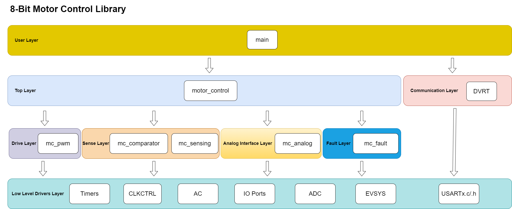
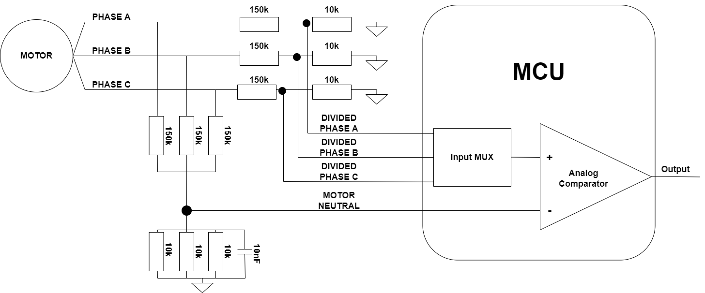
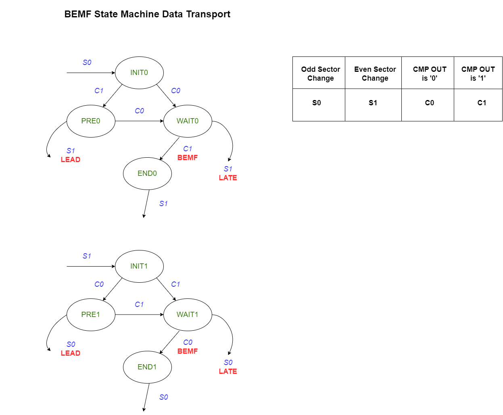
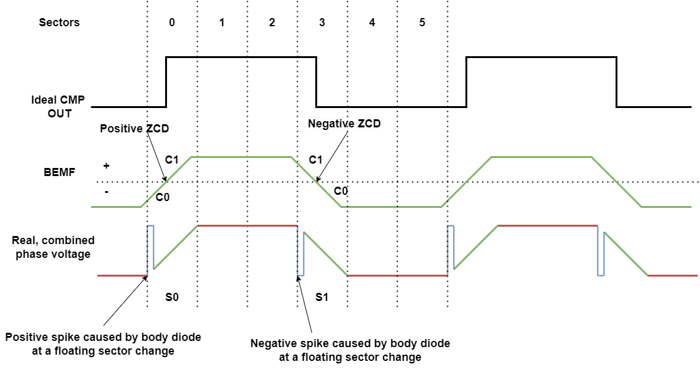
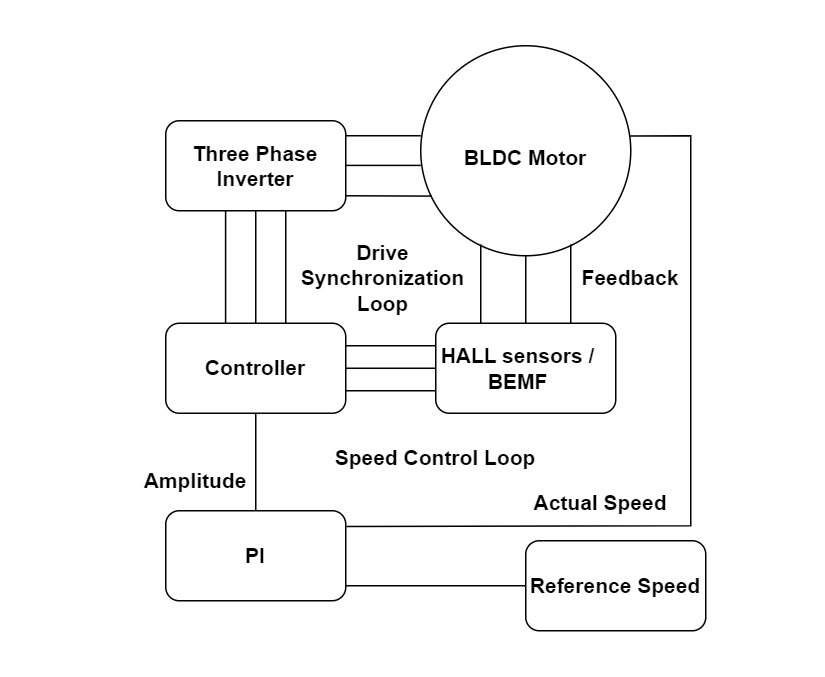

[](https://www.microchip.com)

# Motor Control With AVR®

- This repository contains one bare metal source code example for a Motor Control application, using the new AVR-EB family of devices. Check the *Version Features* section to see all the available functionality on the current release. The approach for this application is focused on the dedicated hardware peripherals of the AVR16EB32 microcontroller (MCU), which reduce the amount of memory used and the Central Process Unit (CPU) overhead as some mathematical calculations are done in hardware by this device. 

- AVR-EB has two new peripherals, the Timer Counter type E (TCE) and a Waveform Extension (WEX), that are specifically oriented for motor control, as described in [Getting started with TCE and WEX](https://onlinedocs.microchip.com/oxy/GUID-8FB8D192-E8C9-4748-B991-D4D842E01591-en-US-1/index.html) and in the [AVR-EB Data sheet](https://www.microchip.com/en-us/product/avr16eb32#document-table).
  
- The functionality of the application is to obtain a Trapezoidal (6-step block commutation) drive method with motor synchronization, with support for both sensored and sensorless feedback types. The focus is on Brushless Direct Current (BLDC) motors and Permanent Magnet Synchronous motors (PMSM).

- The Sensored feedback and synchronization is achieved using Hall sensors. A software algorithm is used to overcome possible faulty transitions of Hall sensors, due to noise or mechanical misalignments, and thus correctly detecting the rotor's position and synchronize the motor with the driving signals.

- The Sensorless feedback and synchronization is achieved using the Zero-Cross Detection (ZCD) of Back-Electromotive Force (BEMF) of the three phases of the motor. Each phase of the motor is filtered to determine when to commutate the motor drive voltages. The position of the rotor sensing algorithm is the same as in the Sensored case, the only difference is the commutation timing, which differs from HALL sensors to BEMF.

## Version Features

Current version 1.0.0 features:

-	Motor specification file
-	Trapezoidal drive
-	Hall Sensor feedback support
-	BEMF sensing
-	Motor–Drive (Rotor-Stator) synchronization (Open loop)
-	Phase Advance selection
-	Start and stop ramps
-	MPLAB® Data Visualizer Run Time (DVRT) communication support for plotting parameters in real time
-   Proportional-Integral (PI) algorithm with fixed parameters for Closed Loop control over speed regulation

Features coming in the next releases:

-	Sensored Sinusoidal drive (Normal, SVPWM, Saddle)
-   Configurable (PI) algorithm for Closed Loop control over speed regulation
-	Hardware Over Current (OCP) and Software Over Voltage (OVP), Under Voltage (UVP), Over Temperature (OTEMP) Fault support 
-   Hall position detection tool
-   Current measurement at run-time

## Related Documentation

More details and code examples on the AVR16EB32 can be found at the following links:

- [AVR<sup>®</sup> EB Product Page](https://www.microchip.com/en-us/products/microcontrollers-and-microprocessors/8-bit-mcus/avr-mcus/avr-eb?utm_source=GitHub&utm_medium=TextLink&utm_campaign=MCU8_AVR-EB&utm_content=avr16eb32-bldc-pmsm-motor-control-library-github&utm_bu=MCU08)
- [AVR<sup>®</sup> EB Code Examples on GitHub](https://github.com/microchip-pic-avr-examples?q=AVR16EB32)

## Software Used

- [MPLAB® X IDE v6.20 or newer](https://www.microchip.com/en-us/tools-resources/develop/mplab-x-ide?utm_source=GitHub&utm_medium=TextLink&utm_campaign=MCU8_AVR-EB&utm_content=avr16eb32-bldc-pmsm-motor-control-library-github&utm_bu=MCU08)
- [AVR-Ex DFP-2.9.197 or newer Device Pack](https://packs.download.microchip.com/)
- [MPLAB® XC8 compiler v2.46](https://www.microchip.com/en-us/tools-resources/develop/mplab-xc-compilers?utm_source=GitHub&utm_medium=TextLink&utm_campaign=MCU8_AVR-EB&utm_content=avr16eb32-bldc-pmsm-motor-control-library-github&utm_bu=MCU08)

## Hardware Used

- [AVR<sup>®</sup> EB Curiosity Nano](https://www.microchip.com/en-us/development-tool/EV73J36A?utm_source=GitHub&utm_medium=TextLink&utm_campaign=MCU8_AVR-EB&utm_content=avr16eb32-bldc-pmsm-motor-control-library-github&utm_bu=MCU08)
- [Multi-Phase Power Board (MPPB)](www.microchip.com/en-us/development-tool/EV35Z86A)
- [AVR-EB Curiosity Nano Adaptor to MPPB](www.microchip.com/en-us/development-tool/EV88N31A)
- BLDC Motor (Suggestion: [ACT57BLF02](https://www.act-motor.com/brushless-dc-motor-57blf-product/))
- A Voltage power supply (24-36V and 1-3A limit)

## Hardware Setup

The AVR16EB32 Curiosity Nano Development board is used along with the MPPB, AVR-EB CNANO to MPPB Adaptor board, the BLDC Motor and a Voltage power supply.

<br>Connections steps:

1. Plug in the AVR16EB32 CNANO board in the connector present on the MPPB Adaptor board.
2. Plug in the MPPB Adaptor board to the MPPB board.
3. Connect the Voltage power supply wires to the V_SUPPLY conector from the MPPB.
4. Connect motor phase wires to the PHASE connector from MPPB in this order: Motor PHASE A -> MPPB PHASE A, Motor PHASE B -> MPPB PHASE B, Motor PHASE C -> MPPB PHASE C.
5. If Sensored control is preferred connect motor Hall wires to the HALL SENSOR connector from the MPPB in this order: Motor HALL A -> MPPB HALL A, Motor HALL B -> MPPB HALL B, Motor HALL C -> MPPB HALL C.

<br>

If the MPPB and the Adaptor boards are not used, the user can integrate the AVR-EB into another hardware setup by using the following pinout:

<b> AVR16EB32 CNANO Board Motor Control Pinout </b>

<br>

## Software Setup

1. Connect the AVR-EB CNANO board to the PC.

2. Open the ```mc_demo.X``` project in MPLAB X IDE.

3. Right click the project and select Set as main project.

<br>

4. Edit the [`mc_config.h`](#the-parameters-found-in-mc_configh-file-to-customize-the-application) file with the utilized motor parameters and drive options.

5. Build the ```mc_demo.X``` project by clicking **Clean and Build Project**.

<br>

6. Click **Make and Program Device** to program the project to the board.

<br>

## Communication Setup

<br> The application has two types of interfaces, only one enabled at a single moment of time:

<br><b><h2>1. Console Interface</h2></b>. To activate it, the `MC_PRINTOUT_ENABLED` must be set to true in [`mc_config.h`](#the-parameters-found-in-mc_configh-file-to-customize-the-application) file. Then simply open a PC software terminal, select the UART protocol, 8N1, with a baud-rate of 460800 bps.
<br> The serial interface provides information about the Drive mode, PWM Scale mode, Sense mode, pole-pairs number, state of the motor, direction of rotation, speed in RPM, voltage, temperature and potentiometer percentage. The periodic interval for printing variables is given in milliseconds and can be configured from `MC_PRINTOUT_REFRESH_INTERVAL` parameter.

<br>

<br><b><h2>2. DVRT tool Interface</h2></b> To activate it, the `MC_DVRT_ENABLED` must be set to true in [`mc_config.h`](#the-parameters-found-in-mc_configh-file-to-customize-the-application) file. This tool provides capabilities to plot graph with variables in real time at run-time. To get the DVRT running follow these steps:

<br>2.1 Build, compile and program AVR-EB with DVRT support enabled.
<br>2.2 Download and install MPLAB Data Visualizer standalone tool from this [link](https://www.microchip.com/en-us/tools-resources/debug/mplab-data-visualizer?utm_source=GitHub&utm_medium=TextLink&utm_campaign=MCU8_AVR-EB&utm_content=avr16eb32-bldc-pmsm-motor-control-library-github&utm_bu=MCU08).
<br>2.3 Open MPLAB Data Visualizer and start a new DVRT Session.
<br>
<br>2.4 Select the AVR-EB communication PORT
<br>
<br>2.5 Set the baud-rate to 460800 bps.
<br>
<br>2.6 Manually load the ELF file. Click on the red marked icon, then navigate to the output folder and point to the elf file. 
<br>
<br>2.7 Add the potentiometer and speed variables
<br>
<br>2.8 *Optional: Change streaming tick to 1 ms and toggle the dark theme
<br>
<br>2.9 Click the play button, and plot all variables button
<br>

As an alternative, the user can press the **Load** button and then go to avr16eb32-bldc-pmsm-motor-control-demo\Apps\mc_demo.X and load the mc_demo_eb_dvws file.
<br>

Capture with graphs of potentiometer in percentage (green) and speed in RPM (yellow) at run-time:
<br>

## Demo Setup

1. Short Press the button present on the MPPB board. The motor starts spinning in clockwise (CW) direction and enters in running state. LED from MPPB turns on. Speed can be adjusted by using the potentiometer present on the MPPB board.
2. Short Press the button from MPPB again. The motor is spinning down, stops and enters in idle state. LED from MPPB turns off.
3. Short Press the button a third time. The motor starts spinning in counterclockwise (CCW) direction and enters in running state. LED from MPPB turns on. Speed can be adjusted by using the potentiometer present on the MPPB board.
4. Short Press the button a fourth time. The motor is spinning down, stops and enters in idle state. LED from MPPB turns off.
5. Short Press the button a fifth time. Go back to step 1.
<br> Long Press the button (more than 1.5 seconds) to restart the application.
<br> If a fault event occurs the motor stops and enters in idle state. LED from MPPB blinks three times and than stays on.

<br> After the hardware and software setup steps are done, the user can start spinning the motor using the button present on the MPPB. By short-pressing the button (under 1.5 seconds) the motor will start spinning in the CW direction in Forced Commutation using a ramp-up to reach a threshold value of speed in a configurable amount of time. After the ramp-up is finished, the application switches to Synchronization mode, either with feedback coming from Hall sensors or BEMF Zero-Crosses (ZCD), depending what is chosen in the `mc_config.h` file.
<br> The speed of the motor is imposed from the potentiometer present on the MPPB. When the motor starts spinning and the synchronization and speed regulation algorithms start working, the LED from MPPB is turned ON. The motor can be stopped by short-pressing the button again. When the stop command is given, the application sets the three motor phases in Floating state, amplitude and speed are set to zero, and from then on the motor will stop naturally, depending on the rotor inertia and the load.
<br> If the button is short-pressed a third time, the motor will start spinning again, but this time in the CCW direction, with the same functionality described above. The user can change the direction of rotation at run-time for as many times as needed, by two short presses of the button from the MPPB. The application can be restarted by long-pressing the button from MPPB for more than 1.5 seconds.
<br> In case of a fault event, the motor stops spinning and enters in an idle state. The normal operation can only be restored if the fault condition is gone and the user short presses the button.
<br> The user can monitor various parameters about the motor like speed in rotations per minute (RPM), voltage bus, temperature of the MOSFET transistors, potentiometer percentage at run-time using a software serial terminal. These parameters are displayed every time a periodic event is encountered(the timing of the periodic event is configurable by the user).
<br> The main application uses a state machine with two states (MOTOR_IDLE and MOTOR_RUN) and four events (BUTTON_SHORT, BUTTON_LONG, FAULT_EVENT and PERIODIC_EVENT) to achieve the functionality described above. The main application and state machine flowcharts can be depicted from the images below:

<br>

<br>

The layers of the application are the following:

- User Layer - Integrates the Control Layer, the Communication interface and the Fault Layer
- [Control Layer](#control-layer) - The layer that integrates all the other layers (except the Communication Interface because it is independent) and is used by the User Layer
- [Drive Layer](#drive-layer) - Achieves Force Commutation without getting any feedback from the motor
- [Sense Layer](#sense-layer) - Gets information about the rotor's position from BEMF or HALL sensors, to synchronize the motor with the drive
- [Analog Layer](#analog-interface-layer) - Monitors the analog parameters
- [Fault Layer](#fault-layer) - Handles the fault events, and stops the motor when needed to prevent irreversible damage.
- Low-Level Drivers Layer - Drivers for low-level peripherals used by the application

Users must use only the public APIs from the `motor_control.h` file so as not to alter the library functionality in any way. All the public APIs are described in the [Control Layer](#the-public-apis-from-the-control-layer-found-in-motor_controlh-are-the-following) section.

<br>

## Drive Layer

The Drive Layer generates the six PWM signals that are used to drive the motor using six-step block commutation. This layer is a wrapper for the low-level drivers of TCE and WEX. The signals' generation block diagram can be observed below.

<br>

WEX has a Pattern Generation mode feature (PGM). It can take control of the output port pins from TCE without stopping the timer. PGM is very useful for Trapezoidal Drive because it can stop the drive for any phase during the floating sectors.

<br>

The sector succession is faster or slower based on the motors' imposed speed.

The driving signals update happens in an Interrupt Service Routine (ISR) every 50 µs. The whole functionality of the Drive Layer can be observed below:

 <br>

 By using only the Drive Layer, the motor can be spun in Forced Commutation mode, updating the driving sequence blindly without using any feedback from the rotor's position. If a load is applied, Forced Commutation is not enough to stop the motor entering in a Stall state. In practice, it is used to spin up a motor to a speed from where it is safe to start the synchronization loop. For example, BEMF is not detectable until the motor reaches at least 10% of the nominal speed, so the motor spins up using a ramp in Force Commutation mode and only then the synchronization and Closed Loop control can start.

## Sense Layer

<b> Hall Sensor Support in Sensored Mode </b>

<br> For sensored feedback, the data from Hall sensors is acquired using three General Purpose Input Output (GPIO) pins. The three pins are set as inputs to the HALL sensors and are sampled periodically during an interrupt window.
<br> The HALL combination read from the pins decides which sector follows next. Usually, these sensors are in number of three and are placed inside the motor, each sensor 120° apart from another one.

<br>

 The Hall transitions are mapped using a state machine with six states (from ST0 up ST5), in a circular shape, that repeats itself over and over. The rotation direction doesn't impact the order scrolling through the states. The order of scrolling through the states will always be ST0 -> ST1 -> ST2 -> ST3 -> ST4 -> ST5 -> ST0 and so on. The state machine implementation can be observed from the images below:

<br>
<br>
<br>

<b> BEMF Acquisition in Sensorless Mode </b>

<br> For sensorless feedback, the values for the BEMF signals for each motor phase are sampled with the Analog Comparator (AC) peripheral. During each sector one of the three motor phases will be in the Floating state and the BEMF can be read from that phase. All the PWM driving signals from that motor phase must be synchronously logically low, the coil is not driven and the signal measured after all the propagation delays is the motor’s BEMF.
<br> The Analog Comparator is connected to the divided motor's phase signals at the positive input using a multiplexed input selection to switch from a motor phase to another and acquire the necessary data. The AC is connected to the motor summing neutral at the negative input. The neutral can be reconstructed either in software or using hardware components like a resistor star configuration. In this application, the hardware motor neutral reconstruction is used. The signals are divided to be in the range of 0 to 3.3V, to be readable by the MCU. The values for the voltage dividers used in this application are the ones present on MPPB.

<br>

<br>The BEMF Zero-Crosses (ZCD) are mapped using a state machine with eight states dictated by the sector change and the polarity of the comparator output change events. The functionality is explained and can be observed in the images below:

<br>• If the Odd Sector change event happens(S0), the comparator output should go from `0` logic to `1` logic to detect a positive ZCD. After the sector changes the state machine enters in INIT0. When the sector is changed and the motor phases is put in a floating state, the body diodes of the MOSFETS enter in conduction mode and a positive spike is induced in the motor phase, and this can interfere with the BEMF acquisition. If that spike is detected the comparator output must be ignored because it would detect a `1` logic signal, a false ZCD, meaning the C1 event happens, and the state machine enters the PLSE0 state to filter the output. If another sector change is happening during the PLSE0 state, than the ZCD of BEMF is coming earlier than expected (LEAD case). When the comparator output goes back to `0` logic, the state machine enters in WAIT0 state, where the real ZCD transition is waited. If another sector change is detected during the WAIT0 state, then the ZCD of BEMF is coming later than expected (LATE case). If the real ZCD is detected and another sector changed didn't happen yet the state machine moves to the END0 state, where it is waiting for another sector change.  

<br>• If the Even Sector change event happens(S1), the comparator output should go from `1` logic to `0` logic to detect a negative ZCD. After the sector changes the state machine enters in INIT1. When the sector is changed and the motor phases is put in a floating state, the body diodes of the MOSFETS enter in conduction mode and a negative spike is induced in the motor phase, and this can interfere with the BEMF acquisition. If that spike is detected the comparator output must be ignored because it would detect a `0` logic signal, a false ZCD, meaning the C0 event happens, and the state machine enters the PLSE1 state to filter the output. If another sector change is happening during the PLSE1 state, than the ZCD of BEMF is coming earlier than expected (LEAD case). When the comparator output goes back to `1` logic, the state machine enters in WAIT1 state, where the real ZCD transition is waited. If another sector change is detected during the WAIT1 state, then the ZCD of BEMF is coming later than expected (LATE case). If the real ZCD is detected and another sector changed didn't happen yet the state machine moves to the END1 state, where it is waiting for another sector change. 

<br>

<br>

<br>The Sense Layer takes feedback from Hall sensors or BEMF and processes that information to estimate the rotor position. The information obtained by this layer is used to synchronize the motor. The Sense Layer is a wrapper for the Analog Comparator (AC) low-level driver and for the GPIO pins used to get data from Hall sensors. The information obtained from both sensors or BEMF can estimate the rotor's position roughly every 60° (electrical degrees).

## Analog Interface Layer

The Analog Layer is responsible of monitoring some of the Motor Parameters for fault protections or for providing useful information for the user at run-time. AVR-EB implements this layer using the 12-bit resolution AD converter (ADC). The analog parameters measured with the ADC are:

- Voltage BUS - Provided at run-time and used for over voltage and under voltage fault triggering, if threshold values are reached)
- Temperature - Provided at run-time and used for over temperature fault triggering, if a treshold is reached)
- Potentiometer - Provided at run-time as a percentage between 0% and 100% and used for imposing a VBUS duty-cycle to the motor in open loop synchronization, 0% meaning the minimum duty-cycle and 100% meaning the maximum duty-cycle. The potentiometer is used to impose a reference speed for the motor in closed loop control

Voltage BUS, Temperature and Potentiometer are converted using the Single-Ended Conversion mode of the ADC with over sampling burst accumulation (due to a feature of the ADC present on AVR-EB a resolution of 17-bits can be achieved). The results obtained can be displayed in Normal mode without filtering, or they can be filtered, with a software filter, to get smoother values.

## Control Layer

<br> The Control Layer is a wrapper for Drive Layer, Sense Layer, Analog Interface Layer and its APIs can be used in the `main.c` file by the user. This layer is responsible for updating the values of the PWM driving signals from Drive Layer based on the feedback it got from the Sense Layer. Also, this layer adjusts the driving sequence to follow the Hall/BEMF sequence to keep the synchronization, and to handles stall situations. Lastly, this layer is used to get more abstract and device independent APIs for monitoring the analog parameters.
<br> This layer implements a rotor sensing position algorithm that can unify the two types of feedback sources (HALL or BEMF) and have the same approach and implementation. The goal of the algorithm is to keep the motor field in sync with the drive field, regardless of the type of feedback. Because the acquisition of BEMF and HALL data is affected by multiple factors like mechanical misalignment or noise, both of these feedback acquisition methods need a filtering algorithm to sense the correct transitions of sensors or BEMF Zero-Cross. The algorithm proposed takes the raw data from BEMF or HALL every complete PWM cycle. The sensing algorithm is called along with the drive update function every 50 μs.

<br>

<br> The data from BEMF or sensors is in a 3-bit format, and it is checked to verify if the current value is different from the previous one. If the condition is true, then a new sector is reached and the raw data is processed through a Look-up Table (LUT) of eight elements to calculate the angle of the rotor. The rotor angle is a 16-bit number that goes from 0 and up to 65536, equivalent to 0° to 359° when scaled in electrical degrees. If the current value of the data acquired from sensors or BEMF is the same as the previous value, then the rotor is still in the current sector.
<br> There is also a time-out angle which is set to 0° at the start of a new sector. If the rotor is still in the current sector and the time-out angle is smaller than 90°, the drive sequence is updated with the value of the drive speed. The drive speed is also a 16-bit number that is used to increment a 16-bit counter that periodically overflows, and this counter specifies the current sector where the stator (drive sequence) is. The speed of the motor is basically the speed of scrolling through a simplified LUT of 256 elements.

<br>

<br> The algorithm counts on the idea that between two transitions from sensors or the BEMF Zero-Cross there is no change in the motor’s speed and the next drive sequence of the rotor and time-out angle can be interpolated with the value of drive speed. Note that the drive speed is measured in electrical degrees per sample. If the time-out angle is equal to or bigger than 120°, then a stall is detected and the motor is forcefully stopped.
<br> A stall of the motor is detected if the current motor state is running and if a new transition from either BEMF or HALL Sensors has not come for more than 120 electrical degrees (time-out condition). If stall conditions are met, the motor is stopped, and to restore the operation short press the MPPB button.

<br>

<br> Based on the calculations done by the sensing algorithm there are three possible cases:
<br>1. The drive field is ahead of the motor field, so the drive speed must be reduced to keep synchronization.
<br>2. The drive field is behind of the motor field, so the drive speed must be increased to keep synchronization.
<br>3. The drive field and the motor field are in phase with one another, withing a range, so the drive speed must not be updated in this situation.

<b>Feedback Signal Comes Ahead of Drive:</b>

<br>

<b>Feedback Signal Comes Behind of Drive:</b>

<br>

<br>To summarize the synchronization method, the sensing algorithm basically estimates the rotor’s position and then calculates the difference between the stator (driving field) and the rotor (motor field). The result (in electrical degrees) represents how much the drive field is out of phase with the motor field. Based on this difference, the drive speed is updated to keep a constant phase shift between stator and rotor. The phase shift value can be configured by the user and it depends upon the load of the motor. If the phase shift is too small the torque might not be enough to keep the synchronization. If the phase shift is too big the synchronization is also lost. An optimal value is determined to have enough torque produced and an efficient power consumption.
<br>

<br> The motor's efficiency, from the power consumption point of view, can be increased by adjusting the phase advance angle or the “lead” angle. In order to have the best efficiency, the BEMF / HALL signals must be in phase with the current signals for each motor phase. Due to the motor’s inductance, the current signals lag the voltage BEMF/HALL signals, so phase advance is used for switching the driving sequence in advance. Because the voltage is switched in advance, the current has time to reach the maximum point until the signal from BEMF or HALL has a transition that marks a sector change. Phase advance angle is added in the speed adjusting algorithm and it is used when the difference between the stator field and the rotor field is calculated. Based on the difference the speed is increased or decreased to keep synchronization.

<br>

<br>Closed Loop control over speed regulation can keep a certain desired value of the speed, even if load variations may appear. Speed regulation is achieved using a software PI algorithm. The algorithm takes two inputs: the desired speed and the actual speed of the motor. Based on the Proportional and Integral parts, the error between the two inputs is calculated and the PWM duty cycle amplitude of the drive signals is changed to keep the desired value of speed while the motor is running. If the amplitude is set to maximum and the value of the desired speed still cannot be reached, then a time-out can be implemented to stop the motor. (This will be available in the next version)

<b>The Control Loops Used by This Application:</b>
<br>

The Speed control loop is slower than the synchronization loop, it can be ten times slower, even twenty times slower. The motor speed behavior using Close Loop for Speed Control can be depicted from the illustration below. In this figure, the motor spins up to 1000 RPM and then keeps this value for speed by changing the amplitude level if a load is applied to the motor’s shaft.

<br>

## The public APIs from the Control Layer found in `motor_control.h` are the following:

<br>• <b>`MC_Control_Initialize()`</b> - Initialization function, needs to be called before any other function
<br>• <b>`MC_Control_SoftStart()`</b> - Starts the motor with a ramp-up from zero RPM up to a target speed in forced commutation, than the application switches to Synchronization mode
<br>• <b>`MC_Control_SoftStop()`</b> - Stops the motor leaving the power switches turned off
<br>• <b>`MC_Control_DelayMs()`</b> - Performs a delay using a timer in the background
<br>• <b>`MC_Control_ReferenceSet()`</b> - Sets the reference point for speed in closed loop, or the amplitude level in open loop synchronization
<br>• <b>`MC_Control_AnalogRead()`</b> - Returns the various analog measurements
<br>• <b>`MC_Control_Speed_Get()`</b> - Returns the rotational speed expressed in `mc_speed_t`
<br>• <b>`MC_Control_PeriodicHandlerRegister()`</b> - Registers a custom software callback for the main application. This function must be called from main, not from interrupt context.
<br>• <b>`MC_Control_FaultNotificationRegister()`</b> - Registers a custom software callback that specifies the source of fault and to sends a notification to the user. This function must be called from main, not from interrupt context.

## The parameters found in `mc_config.h` file to customize the application:

<br><b> MOTOR SETTINGS </b>

<br>• <b>`MOTOR_HALL_DEVIATION_CW`</b> and <b>`MOTOR_HALL_DEVIATION_CCW`</b>- Hall sensors are imperfect, and deviations can appear from mechanical placements or other various reasons. These parameters are determined manually and are expressed in electrical degrees
<br>• <b>`MOTOR_PHASE_ADVANCE`</b> - Can range from 0 to 90 electrical degrees. This parameter is used to obtain greater speeds than the maximum the drive algorithm would normally be able to obtain and also to optimize the power consumption
<br>• <b>`MC_MOTOR_POLE_PAIRS`</b> - Can range from 1 to 28 pole pairs, usually suppplied by the motor manufacturer in the data sheet
<br>• <b>`MC_MIN_SPEED`</b> - Used as target RPM speed by the ramp-up algorithm, spinning up from zero to target speed. This is the speed from where the switchover between forced commutation and synchronization loop starts
<br>• <b>`MC_RAMP_UP_DURATION`</b> - The desired duration for the Ramp-up algorithm, given in milliseconds
<br>• <b>`MC_RAMP_DOWN_DURATION`</b> - The desired duration for the Ramp-down algorithm, given in milliseconds
<br>• <b>`MC_STARTUP_VOLTAGE`</b> - The amount of voltage supplied to the motor phases during the startup phase, given in volts. If the supply voltage is less than the start-up voltage the application will throw and error message and motor ramp-up will fail

<br><b> POWER BOARD SETTINGS </b>

<br>• <b>`MC_SHUNT_RESISTANCE`</b> - The current sense shunt resistance, given in ohms, dependent on the power board
<br>• <b>`MC_CURR_SENSOR_GAIN`</b> - The current sense amplifier, dependent on the power board
<br>• <b>`MC_CURR_SENSOR_OFFSET`</b> - The current sense offset, dependent on the power board
<br>• <b>`MC_VBUS_DIVIDER`</b> - The voltage divider, used to scale the VBUS to be able to measure it with the MC_VOLTAGE_REFFERENCE logic, dependent on the power board
<br>• <b>`MC_VOLTAGE_REFFERENCE`</b> - The voltage reference (this application has a 3V3 logic)
<br>• <b>`MC_TEMP_K1`</b> - The temperature sensor coefficient, dependent on the power board
<br>• <b>`MC_TEMP_K1`</b> - The temperature sensor coefficient, dependent on the power board

<br><b> PWM DRIVE SETTINGS </b>

<br>• <b>`PWM_DTH`</b> - The value of dead-time inserted at the left of one complementary PWM signals pair, given in nanoseconds
<br>• <b>`PWM_DTL`</b> - The value of dead-time inserted at the right of one complementary PWM signals pair, given in nanoseconds
<br>• <b>`PWM_PERIOD`</b> - The value of the PWM signals period given in microseconds
<br>• <b>`MC_SCALE_MODE`</b> - Selects the scaling from PWM signals to start from 0% up to 100% duty cycle in `MC_SCALE_BOTTOM` mode

<br><b> APPLICATION SETTINGS </b>

<br>• <b>`MC_DVRT_ENABLED`</b> - Enables or disables the communication DVRT tool
<br>• <b>`MC_PRINTOUT_ENABLED`</b> - Enables or disables the information printing using a serial terminal software. The application can have only one of `MC_DVRT_ENABLED` and `MC_PRINTOUT_ENABLED` options available at the same time, otherwise an error will appear at compilation time
<br>• <b>`MC_PRINTOUT_REFRESH_INTERVAL`</b> - Used by a periodic event to print various analog parameters and motor parameters like speed in RPM, voltage VBUS etc.

<br><b> CONTROL FUNCTIONALITY SETTINGS </b>

<br>• <b>`MC_SPEED_REGULATOR_EN`</b> - Enables or disables the closed loop over speed regulation
<br>• <b>`MC_SYNCHRONIZED`</b> - Activates the synchronization loop. When the amplitude of the motor is modified or a load is applied to the motor's shaft the speed will change accordingly not to lose synchronization. If the dynamic load change is too great, after a time-out the application will detect a motor stall
<br>• <b>`MC_CONTROL_MODE`</b> - Selects between sensored with Hall sensors Control `MC_SENSORED_MODE` mode and sensorless with BEMF Control mode `MC_SENSORLESS_MODE`
<br>• <b>`MC_DRIVE_MODE`</b> - Selects the drive method between Trapezoidal `MC_STEPPED_MODE` and Sinusoidal `MC_CONTINUOUS_MODE` (will be available in the next version)
<br>• <b>`MC_STALL_EVENTS_THRESHOLD`</b> - Number of misalignment events before throwing a stall error

## Results

Below are some logic analyzer and oscilloscope captures, to have a better view about the waveforms of the three motor phases:

<br>Capture taken at 4800 mechanical RPM at 24V with 10 electrical degrees phase advance  
<br>
<br>Capture taken at 5200 mechanical RPM at 24V with 30 electrical degrees phase advance
<br>

## Summary

<br>This project provides support for spinning a BLDC motor using a Trapezoidal Drive method and feedback from HALL sensors or from BEMF Zero-Crosses to achieve motor synchronization in Open Loop and fixed Closed Loop for speed regulation. The control algorithm is fairly simple and robust. AVR-EB's hardware capabilities for scaling the PWM duty cycle and to generate complementary signals with dead-time using only one timer with it's waveform extension ensures the CPU doesn't have a big overhead and optimizes the memory usage and resources consumption.
<br>The demo has an user layer that offers customizations to adjust motor and power board parameters that makes it suitable for multiple setups. There is a dedicated user layer that allow for full control without disturbing the AVR EB dedicated HW configurations.